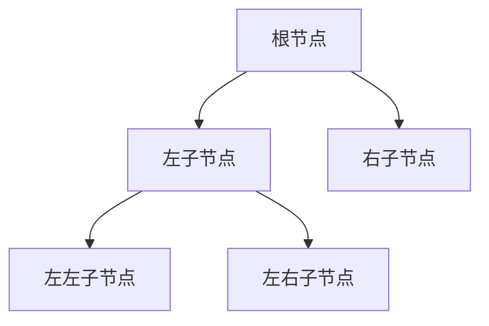

# 二叉树



## 二叉树的定义

- 结点：二叉树由若干个结点组成，每个结点最多有两个子结点。
- 子树：每个结点可以有一个左子树和一个右子树。
- 递归定义：二叉树要么是空树，要么是一个根结点和两棵分别称为左子树和右子树的二叉树组成。

## 二叉树的性质

**性质 1**

二叉树的第 $i$ 层结点的个数为 $2^{i - 1}$ 个。

**性质 2**

深度为 $h$ 的二叉树至多有 $2^h - 1$ 个结点。

::: details 点击查看注释
等比数列通项公式：
$$a_n = a_1 q^{n - 1}$$

等比数列前 $n$ 项和：
$$S_n = \frac{a_1 (1 - q^n)}{1 - q}$$
$$S_n = na_1, (q = 1)$$
:::

**性质 3**

在二叉树中，叶子结点数 $L$ 总是比度为 $2$ 的结点数 $N_2$ 多 $1$ 个，即 $L = N_2 + 1$。

::: details 点击查看注释
设结点总数为 $n$，叶子结点树为 $n_0$，度为 $1$ 的结点数为 $n_1$，度为 $2$ 的结点数为 $n_2$，则有：
$$n = n_0 + n_1 + n_2$$

设分支（结点的关系/连线）数为 $B$，除了根结点外，每个结点总有一个分支。因此，结点数和分支的关系为：
$$n = B + 1$$

分支是由度为 $1$ 或 $2$ 的结点射出来的，可得：
$$B = n_1 + 2n_2$$
$$即 n = n_1 + 2n_2 + 1$$

由 $n = n_1 + 2n_2 + 1$ 与 $n = n_0 + n_1 + n_2$ 两式相减可得：
$$n_0 = n_2 + 1$$
:::

**性质 4**

具有 $n$ 个结点的[完全二叉树](#完全二叉树)的最大深度为 $\lfloor \log_2{n} \rfloor + 1$。

## 遍历二叉树

```c
#include <stdio.h>
#include <stdlib.h>

typedef struct TreeNode {
    int value;               // 结点的值
    struct TreeNode* left;   // 左子结点
    struct TreeNode* right;  // 右子结点
} TreeNode;

// 创建新结点
TreeNode* createNode(int value) {
    TreeNode* newNode = (TreeNode*)malloc(sizeof(TreeNode));
    newNode->value = value;
    newNode->left = NULL;
    newNode->right = NULL;
    return newNode;
}
```

### 先序遍历

> Preorder Traversal

先访问根结点，然后访问左子树，最后访问右子树。

```c
void preOrder(TreeNode* root) {
    if (root == NULL) return;
    printf("%d ", root->value);  // 访问根结点
    preOrder(root->left);        // 递归遍历左子树
    preOrder(root->right);       // 递归遍历右子树
}
```

### 中序遍历

> Inorder Traversal

先访问左子树，然后访问根结点，最后访问右子树。

```c
void inOrder(TreeNode* root) {
    if (root == NULL) return;
    inOrder(root->left);         // 递归遍历左子树
    printf("%d ", root->value);  // 访问根结点
    inOrder(root->right);        // 递归遍历右子树
}
```

### 后序遍历

> Postorder Traversal

先访问左子树，然后访问右子树，最后访问根结点。

```c
void postOrder(TreeNode* root) {
    if (root == NULL) return;
    postOrder(root->left);       // 递归遍历左子树
    postOrder(root->right);      // 递归遍历右子树
    printf("%d ", root->value);  // 访问根结点
}
```

## 满二叉树

- 每个非叶子节点都有两个子节点，所有叶子节点都在同一层。
- 节点总数为 $2^h - 1$。

## 完全二叉树

- 除了最后一层外，每一层都达到最大节点数。
- 最后一层从左到右连续排列，中间没有空缺。
